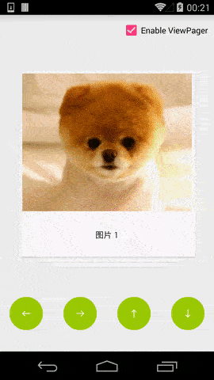
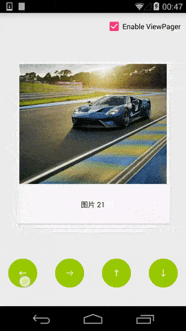
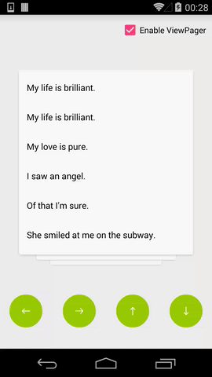

# StackCardsView

#### [demo apk download](https://github.com/wensefu/StackCardsView/blob/master/StackCardsView-demo.apk?raw=true)

堆叠滑动控件，类似于社交软件探探的效果，并增加以下扩展：

- **支持滑动方向控制**
- **支持消失方向控制**
- **支持嵌入到ViewPager等滑动控件**
- **支持内嵌ListView,RecycleView等滑动控件**


-------------------

效果演示
-------

 &ensp;&ensp;&ensp;&ensp;&ensp;
<br/><br/>
&ensp;&ensp;&ensp;&ensp;&ensp;

-------------------

如何使用
-------

 - xml引入StackCardsView:

``` xml
    <com.beyondsw.lib.widget.StackCardsView
        android:id="@+id/cards"
        android:layout_width="match_parent"
        android:layout_height="match_parent"
        app:itemHeight="340dp"
        app:itemWidth="340dp"
        android:paddingBottom="66dp"
        android:clipToPadding="false"
        />
```
支持的xml属性设置：

| 属性名 |    说明 | 类型  |是否必须|
| :-------- | :------| :-- |:--: |
| itemWidth  | 卡片宽度 |  dimension   |是|
| itemHeight     |   卡片高度 |  dimension  |是|
| maxVisibleCnt      |    不滑动时最多可以看到的卡片数 | integer  |否|
| edgeHeight      |    层叠效果高度 | dimension  |否|
| scaleFactor      |    每层相对于上层的scale系数 | float  |否|
| alphaFactor      |    每层相对于上层的alpha系数 | float  |否|
| dismissFactor      |    滑动距离超过控件宽度的多少比例时消失 | float  |否|
| dragSensitivity      |    滑动灵敏度 | float  |否|

<br/><br/>


``` java
设置adapter:

  mCardsView = Utils.findViewById(root,R.id.cards);
  mCardsView.addOnCardSwipedListener(this);
  mAdapter = new CardAdapter();
  mCardsView.setAdapter(mAdapter);


public class CardAdapter extends StackCardsView.Adapter {

    private List<BaseCardItem> mItems;

    public void appendItems(List<BaseCardItem> items){
        int size = items == null ? 0 : items.size();
        if (size == 0) {
            return;
        }
        if (mItems == null) {
            mItems = new ArrayList<>(size);
        }
        mItems.addAll(items);
        notifyDataSetChanged();
    }

    public void remove(int position){
        mItems.remove(position);
        notifyItemRemoved(position);
    }

    @Override
    public int getCount() {
        return mItems == null ? 0 : mItems.size();
    }

    @Override
    public View getView(int position, View convertView, ViewGroup parent) {
        return mItems.get(position).getView(convertView,parent);
    }

    @Override
    public int getSwipeDirection(int position) {
        //这里控制每张卡的支持滑动超过一定距离消失的方向
        BaseCardItem item = mItems.get(position);
        return item.swipeDir;
    }

    @Override
    public int getDismissDirection(int position) {
        //这里控制每张卡的支持滑动超过一定距离消失的方向
        BaseCardItem item = mItems.get(position);
        return item.dismissDir;
    }

    @Override
    public boolean isFastDismissAllowed(int position) {
        //这里控制每张卡的支持快速滑动消失的方向
        BaseCardItem item = mItems.get(position);
        return item.fastDismissAllowed;
    }

    @Override
    public int getMaxRotation(int position) {
         //这里控制每张卡的最大旋转角
        BaseCardItem item = mItems.get(position);
        return item.maxRotation;
    }
}
```


[问题反馈](https://github.com/wensefu/StackCardsView/issues "问题反馈")


License
-------

    Copyright 2017 wensefu
    Licensed under the Apache License, Version 2.0 (the "License");
    you may not use this file except in compliance with the License.
    You may obtain a copy of the License at

        http://www.apache.org/licenses/LICENSE-2.0

    Unless required by applicable law or agreed to in writing, software
    distributed under the License is distributed on an "AS IS" BASIS,
    WITHOUT WARRANTIES OR CONDITIONS OF ANY KIND, either express or implied.
    See the License for the specific language governing permissions and
    limitations under the License.